# Factory.ai architecture graph

Generated from `factory.ai` with [Graphify](https://github.com/Graphify-Labs/graphify) v0.9.32.

## Start here

```mermaid
flowchart LR
    Linear[Linear issue] --> Tick[Daemon tick]
    Tick --> Freshness[Claim + freshness checks]
    Freshness --> Workspace[Isolated git worktree]
    Workspace --> Implementer[Implementer agent]
    Implementer --> Review[Claude + Codex adversarial review]
    Review --> Fixer[Fixer iterations]
    Fixer --> Gates[Baselined verification + taste/security gates]
    Gates --> PR[PR + Factory report]
    PR --> Ladder[Evidence-gated merge ladder]
    Ladder --> PostMerge[Deploy / smoke / revert watch]
    PostMerge --> Telemetry[(Postgres telemetry)]
    Telemetry --> Lessons[Lessons flywheel]
    Telemetry --> Groundskeepers[Groundskeeper work generators]
    Lessons --> Implementer
    Groundskeepers --> Linear
```



The Mermaid map is the readable operator view. The generated graph below is the full implementation topology.

## Generated outputs

- [`GRAPH_REPORT.md`](./GRAPH_REPORT.md) — architecture summary, communities, hubs, cycles, weak spots and suggested questions.
- [`graph.html`](./graph.html) — interactive force-directed graph with search, filters, community toggles and node details. Download or serve locally; GitHub does not execute committed HTML.
- [`factory-callflow.html`](./factory-callflow.html) — 16 Mermaid call-flow diagrams across the main architecture sections, with zoom/pan and call tables.
- [`GRAPH_TREE.html`](./GRAPH_TREE.html) — expandable hierarchy/tree view.
- [`graph.svg`](./graph.svg) — static full-graph vector export. Useful for zooming or embedding, but intentionally dense.
- [`graph-preview.png`](./graph-preview.png) — raster preview of the static graph.
- [`graph.graphml`](./graph.graphml) — import into Gephi, yEd or Cytoscape for custom layouts and analysis.
- [`graph.json`](./graph.json) — queryable source of truth used by Graphify CLI/MCP and agents.
- [`community-labels.json`](./community-labels.json) — human-readable names for detected Leiden communities.
- [`manifest.json`](./manifest.json) — extraction manifest and source-file inventory.

## Current snapshot

- Source commit: `72719718`
- Nodes: **1,405**
- Edges: **3,785**
- Communities: **62**
- Edge provenance: **98% extracted**, **2% inferred**, **0% ambiguous**
- Import cycles: **none detected**
- Estimated query reduction: **5.5× fewer tokens** than naive corpus reading

The graph was extracted locally with Tree-sitter (`--code-only`). Community naming used Claude CLI over structural summaries; Graphify did not perform LLM semantic extraction over the source corpus.

## What the graph says

The real orchestration centre is `processIssue()` with 83 connections. That is expected, but it is also the highest-value blast-radius review point.

Other structurally important nodes:

- `redactSecrets()` — 41 connections; security boundary shared across outbound surfaces.
- `runStage()` — agent execution and budget-control choke point.
- `bus` — event spine joining runtime telemetry and UI state.
- `bootstrapProject()` and `planIssue()` — the autonomous project-intake bookends.
- `startDashboard()` — bridge from runtime events into mission control.

`cn()` is technically the highest-degree node at 89 edges, but that is a UI class-name utility, not a domain centre. Degree alone is not architecture.

The graph also exposes hundreds of weakly connected nodes. Many are package/config literals, test fixtures and parsed manifest values rather than missing product links; treat that population as a triage queue, not automatically as technical debt.

## Refresh

Prerequisites:

```bash
uv tool install 'graphifyy[svg,leiden]==0.9.32'
claude auth status
```

Then run:

```bash
bun run graphify:refresh
```

The refresh script performs deterministic local AST extraction, labels communities through Claude CLI, regenerates every published format, and removes local absolute paths from committed HTML/Markdown.

For code-only updates without relabelling:

```bash
graphify update .
```
